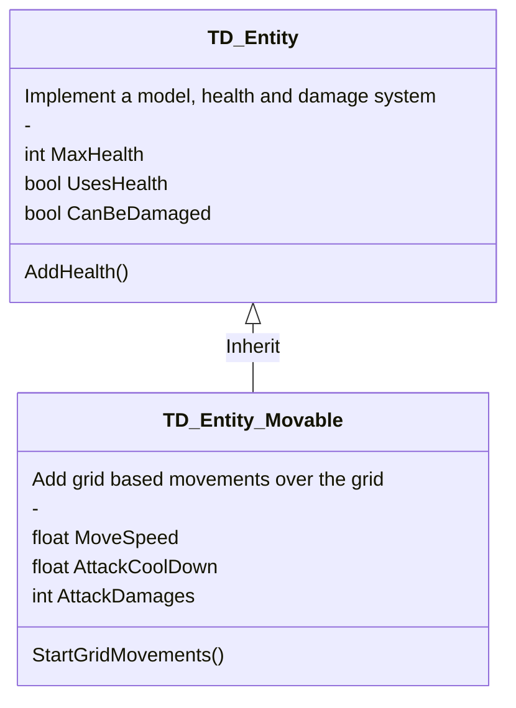

# Classes Chart

This diagram explain classes organisation and inheritance in the Tower Defense Template.\
[Help to understand this diagram ?](https://mermaid-js.github.io/mermaid/#/classDiagram)

> **_Warning:_**  This document is not complete.

