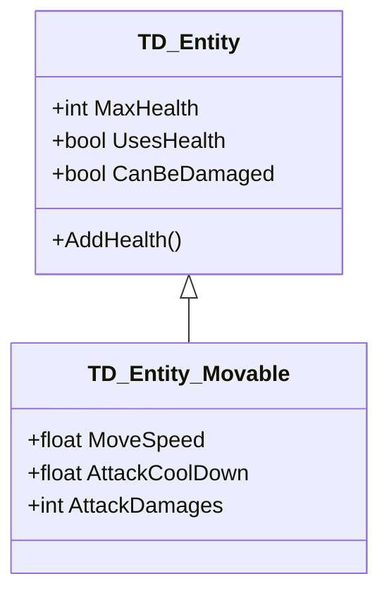

```mermaid
 classDiagram
      TD_Entity <|-- TD_Entity_Movable
 
      class TD_Entity
        TD_Entity: +int MaxHealth
        TD_Entity: +bool UsesHealth
        TD_Entity: +bool CanBeDamaged
        TD_Entity: +AddHealth()
      
      class TD_Entity_Movable
        TD_Entity_Movable: +float MoveSpeed
        TD_Entity_Movable: +float AttackCoolDown
        TD_Entity_Movable: +int AttackDamages
```
