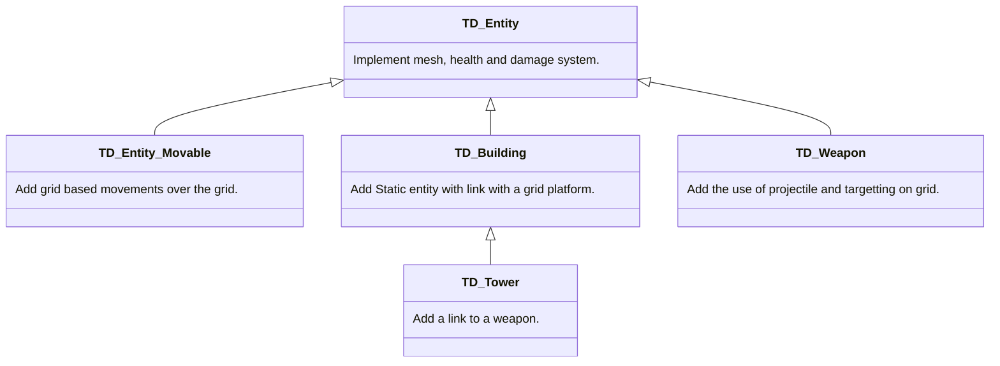
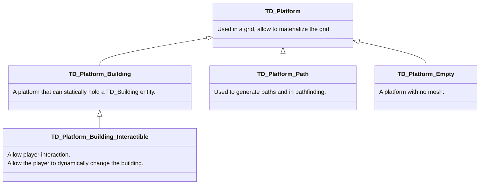
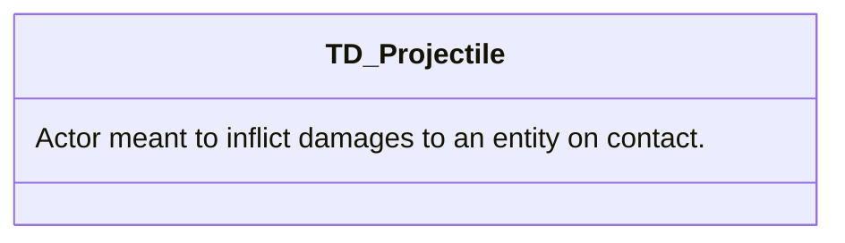

# Classes Chart

Those diagrams explain classes organisation and inheritance in the Tower Defense Template.\
[Help to understand diagrams ?](https://mermaid-js.github.io/mermaid/#/classDiagram)

> **_Warning:_**  This document is not complete.

## TD_Entity

## TD_Platform

## Others

